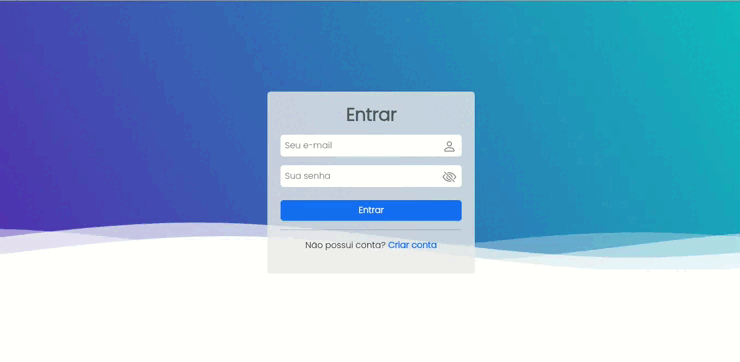

# Tela Login

Este projeto foi gerado com [Angular CLI](https://github.com/angular/angular-cli) versão 15.0.3.

## Servidor de desenvolvimento

Para vizualizar o projeto rode `ng serve `no terminal dentro da raiz do projeto, e no navegador entre em `http://localhost:4200/`.

## Pré vizualização: 

    

## Projeto em constante desenvolvimento... :hourglass:
